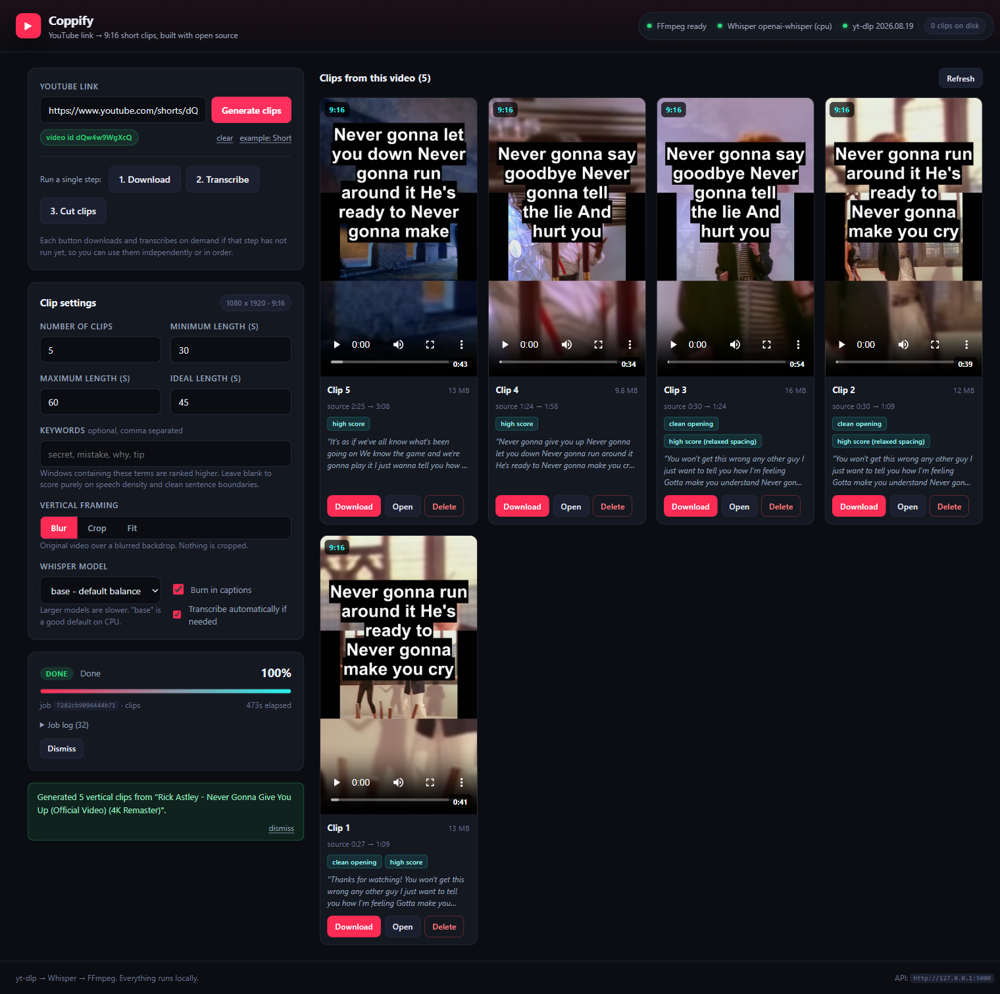

# Coppify

Turn any YouTube link into TikTok-ready vertical clips.  
Coppify downloads the video, transcribes it with Whisper, finds the strongest moments, and renders them as 9:16 short clips — all locally, no cloud services required.



## What it does

- Paste a YouTube link
- Download the video with `yt-dlp`
- Transcribe speech with OpenAI Whisper
- Auto-select the best 30–60 s windows
- Render clean 1080 × 1920 vertical clips
- Preview, download, or delete clips from the gallery


## Quick start

```bash
# 1. Clone and enter the project
cd "C:\Protected File\Real Project\Open Coppify"

# 2. Install backend dependencies
python -m pip install -r backend/requirements.txt

# 3. Install frontend dependencies
npm --prefix frontend install

# 4. Run both servers
npm start
```

Then open:

- Frontend: http://localhost:3000
- Backend API: http://127.0.0.1:5000

## Project structure

```
Open Coppify/
├── backend/
│   ├── app.py                 # Flask entrypoint
│   ├── config.py              # Central configuration
│   ├── jobs.py                # Async job registry + progress
│   ├── requirements.txt       # Python dependencies
│   ├── routes/
│   │   └── api.py             # /api/download, /transcribe, /clips
│   └── services/
│       ├── downloader.py      # yt-dlp download flow
│       ├── transcriber.py     # Whisper transcription + chunking
│       ├── segmenter.py       # Clip selection + keyword scoring
│       ├── clipper.py         # FFmpeg 9:16 render + captions
│       └── ffmpeg_utils.py    # FFmpeg discovery + shim
├── frontend/
│   ├── src/
│   │   ├── App.jsx            # Main layout + job orchestration
│   │   ├── api.js             # Axios client + API helpers
│   │   ├── hooks/
│   │   │   └── useJob.js      # Job polling + backoff
│   │   └── components/
│   │       ├── UrlForm.jsx
│   │       ├── OptionsPanel.jsx
│   │       ├── ProgressPanel.jsx
│   │       ├── ClipGallery.jsx
│   │       ├── TranscriptPanel.jsx
│   │       └── HealthBar.jsx
│   ├── package.json
│   ├── vite.config.js
│   └── index.html
├── static/
│   ├── clips/                 # Generated vertical clips
│   ├── downloads/             # Cached YouTube downloads
│   ├── transcripts/           # Cached Whisper transcripts
│   └── tmp/                   # Scratch media
├── package.json               # Root scripts
└── scripts/
    └── dev.mjs                # Parallel backend + frontend launcher
```

## Tech stack

| Layer | Tool |
|-------|------|
| Backend | Flask + flask-cors |
| Download | yt-dlp |
| Transcription | OpenAI Whisper / faster-whisper |
| Video render | FFmpeg (libx264, 9:16 filters) |
| Frontend | React + Vite |
| HTTP client | Axios |
| Styling | CSS |

## API surface

| Method | Path | Purpose |
|--------|------|---------|
| POST | `/api/download` | Download a YouTube video |
| POST | `/api/transcribe` | Generate timestamped transcript |
| POST | `/api/clips` | Select + render vertical clips |
| GET | `/api/clips` | Gallery listing |
| GET | `/api/jobs/<id>` | Poll job progress |
| POST | `/api/jobs/<id>/cancel` | Cancel a running job |
| GET | `/api/health` | Backend diagnostics |

Every long-running endpoint returns a job immediately. The frontend polls `/api/jobs/<id>` with exponential backoff and renders live progress.

## Clip selection logic

Coppify does not blindly cut fixed windows. It scores candidate segments using:

1. **Keyword density** — how often requested terms appear
2. **Speech density** — words per second vs. the video median
3. **Boundary quality** — prefers clean sentence starts/ends
4. **Length fit** — rewards windows close to the target length
5. **Position** — penalises intros and outros

Top candidates are then greedily selected with a minimum gap so the gallery never shows five variations of the same 40 seconds.

## Configuration

All tunables live in `backend/config.py`. Common overrides via environment variables:

```bash
COPPIFY_CLIP_MIN_SECONDS=30
COPPIFY_CLIP_MAX_SECONDS=60
COPPIFY_CLIP_TARGET_SECONDS=45
COPPIFY_WHISPER_MODEL=base
COPPIFY_VERTICAL_WIDTH=1080
COPPIFY_VERTICAL_HEIGHT=1920
```

## Development

```bash
# Backend only
python backend/app.py

# Frontend only
npm --prefix frontend start

# Full test suite
npm test
```

## Notes

- `ffprobe` is not required; Coppify probes media by parsing `ffmpeg -i` output.
- MoviePy is listed in `requirements.txt` only to locate a bundled FFmpeg binary. Actual rendering uses direct FFmpeg subprocess calls for speed and progress accuracy.
- Generated media is git-ignored via `.gitignore` while the folder structure is preserved with `.gitkeep` files.
